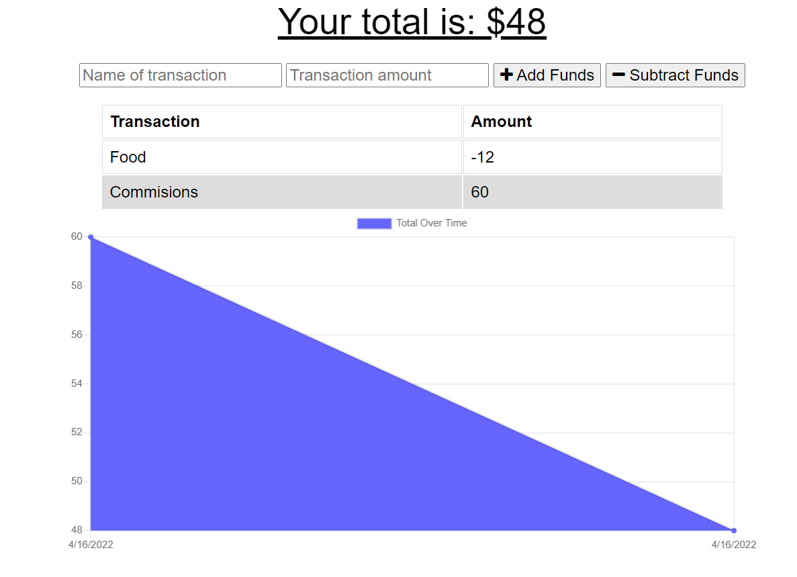

# PWA-Budget-Tracker

## Description
  An application used to track expenses and deposits.

## Table of Contents

  - [Installation](#installation)
  - [Website](#Website)
  - [Usage](#usage)
  - [Screenshot](#Screenshot)
  

  ## Installation
  Git clone https://github.com/jreese8/PWA-Budget-Tracker.

  ## Website
  https://damp-earth-98529.herokuapp.com/

  
  ## Usage
  Type in the name and amount of your transaction. Click either the "+ Add Funds" button or the "- Subtract Funds" reagarding the type of transaction. Total funds available are dispalyed at the top.

  ## Screenshot
  